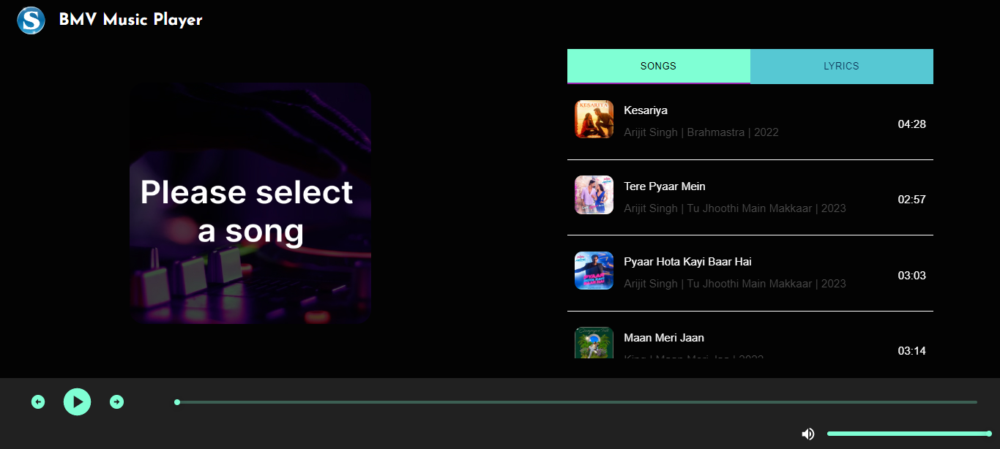
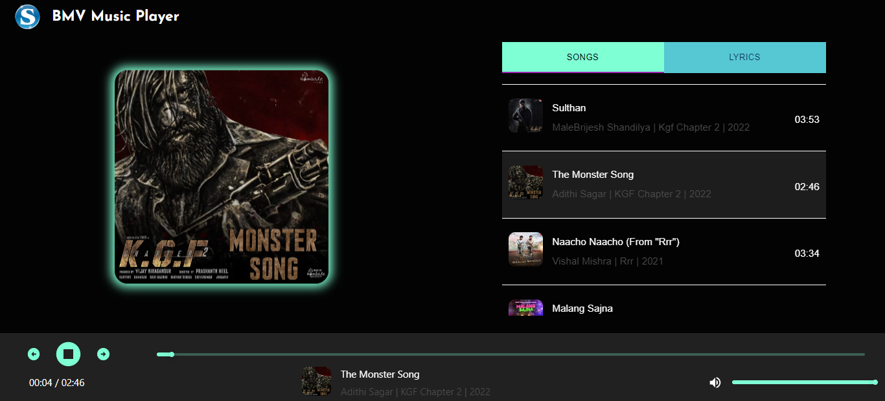
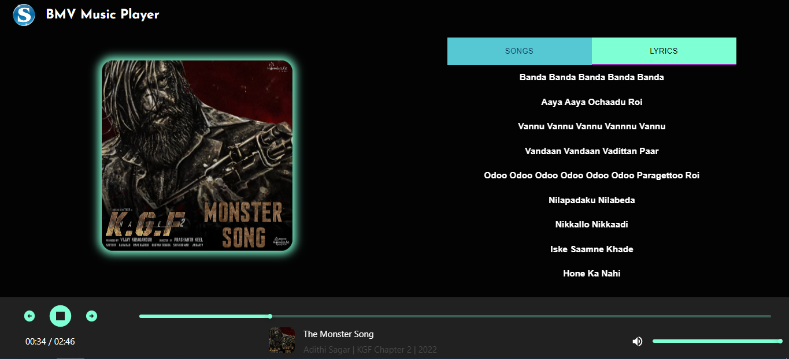

# React Music Player

## Overview
  - This is a simple music player.

## Features
  - You can perform above thing with this player.
    - Play music.
    - Paush music.
    - Play next music.
    - Play privios music.
    - Play music by click on music.
    - Paush music by click on music.
    - You can add song from your local PC and play them.

- For add music
    - Add your music in songs folder.
    - Check your music information from API, and add them on songs.js file.

## Technologies Used
  - ReactJS - JavaScript library for building user interfaces
  - Material ui - For designing
  - For lyrics and song information we use RapidAPI (https://rapidapi.com/Glavier/api/spotify23)

## Getting Started
  - Clone the repository: <code>git@github.com:systemintegration/react-movie-library.git</code>
  - Install dependencies: <code>npm install</code>
  - Start the development server: <code>npm start</code>

## Contributing
  - Contributions are welcome! To contribute to the project, follow these steps:
    - Fork the repository
    - Create a new branch: <code>git checkout -b my-feature-branch</code>
    - Make your changes and commit them: <code>git commit -am 'Add some feature'</code>
    - Push your changes to your branch: <code>git push origin my-feature-branch</code>
    - Create a new pull request and explain your changes
In the project directory, you can run:

## Screenshots
  - First page when you run the project.
   

  - When You play song.
   

  - When You see lyric of song.
   

## Demo
   - You can try out the application at <a href="https://systemintegration.github.io/react-movie-library/">https://systemintegration.github.io/react-movie-library/</a>
